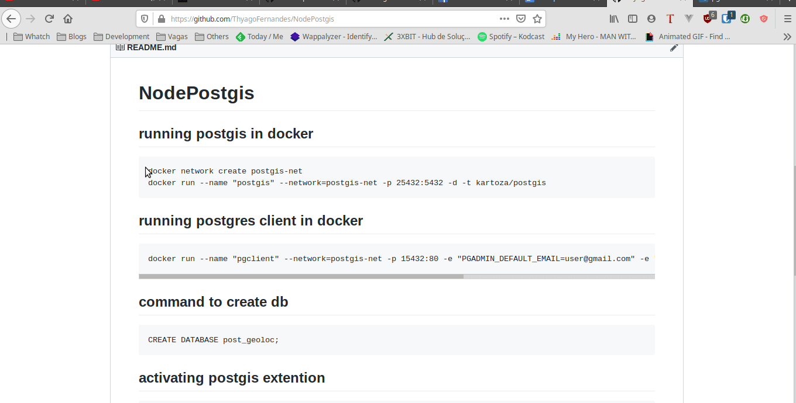
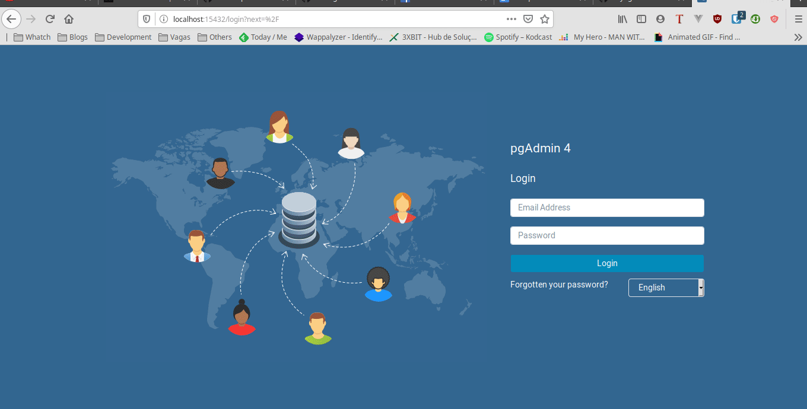

# NodePostgis
## running postgis in docker
```
docker network create postgis-net
docker run --name "postgis" --network=postgis-net -p 25432:5432 -d -t kartoza/postgis
```
## running postgres client in docker
```
docker run --name "pgclient" --network=postgis-net -p 15432:80 -e "PGADMIN_DEFAULT_EMAIL=user@gmail.com" -e "PGADMIN_DEFAULT_PASSWORD=userpwd" -d dpage/pgadmin4
```
## command to create db
```
CREATE DATABASE post_geoloc;
```
## activating postgis extention
```
CREATE EXTENSION postgis;
```

## creating table in database
```
create table places(lat_lng geography(Point,4326),place_name varchar(50));
```
## container initialization demo


## geospatial database configuration


## project setup
```
npm install
```

## running the project
```
npm start
```
